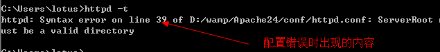
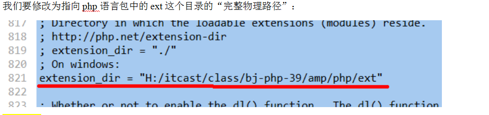

#第一天笔记

**使用CLI(命令行界面)执行.php文件(需要配置好环境变量)**

- **命令行运行PHP文件**
<pre>
php -f "文件路径"
php -f "c://abc.php"		
</pre>

- **命令行运行PHP代码**
<pre>
php -r "php代码"
php -r "echo 'hello world!';"		
</pre>

- **WEB的运行模式**

- **PHP的运行原理**

- **安装Apache(需要配置好环境变量)**
<pre>
httpd -k install		
</pre> 

- **Apache的目录结构**
 

- **Apache检查配置文件语法**

  

 

####但是做完上面的步骤，把php文件放到htdocs文件夹，在localhost访问话，还是不能访问解释后的php代码，仅仅只是返回php的代码，这是因为缺少Apache对php的关联，所以我们需要为apache关联php模块
 

- **在httpd.conf中添加PHP的关联管理步骤**
 

 

 

- **PHP的时区不对的问题，由于默认使用的格林时间，所以存在时区异常，差了8个小时**
<pre>
<meta http-equiv = "Content-Type" content="text/html;charset=UTF-8">
echo "当前的时间是:".date("Y-m-d H:i:s");

这是，因为，我们还没有配置php语言模块（语言引擎）的运行时区！
需要去修改php的配置文件：
php的配置文件位置：
php语言包/php.ini
</pre>
 
我们采用php.ini-development，改其后缀就可以了！
 

 
之后重启apache即可

 

- **安装MySQL,安装过程忽略**

首先还是先打开php对于Mysql的支持模块，在php.ini中，修改以下即可，
 

 

   

#主机（站点）配置

   

后面的内容请看笔记1(多虚拟主机，别名，多域名对应一台虚拟主机)